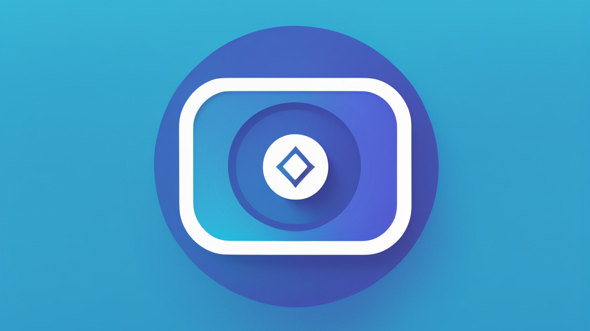

# VidyaBot  

> ⚠️ **Note:**
>
> VidyaBot is not yet available to use.

A Discord bot for downloading videos from video sharing sites and sharing directly within Discord.

## 🗂️ Dependencies used

* [Discord.NET](https://github.com/discord-net/Discord.Net)
* [yt-dlp](https://github.com/yt-dlp/yt-dlp)

## 🤝 License

The source code for this project is licensed with the [MIT License](./LICENSE).